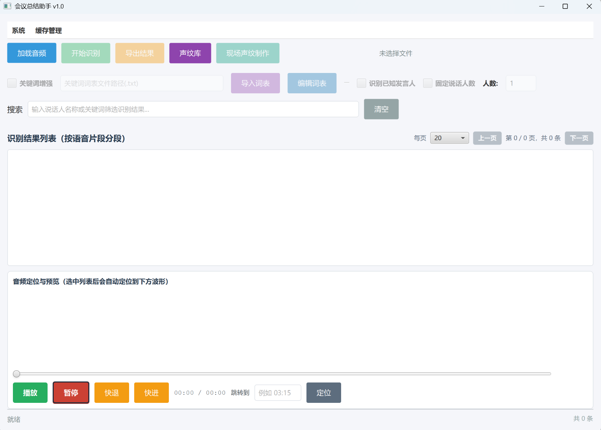
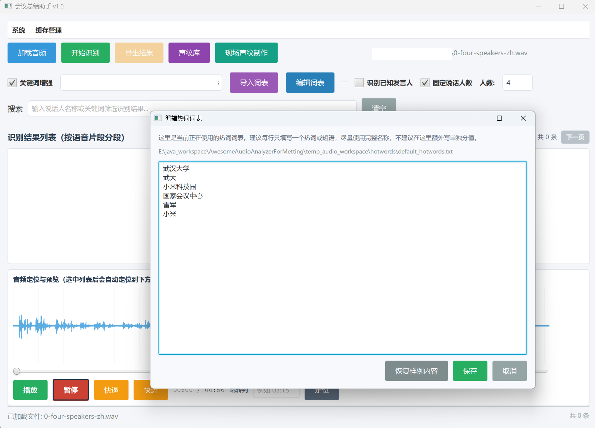
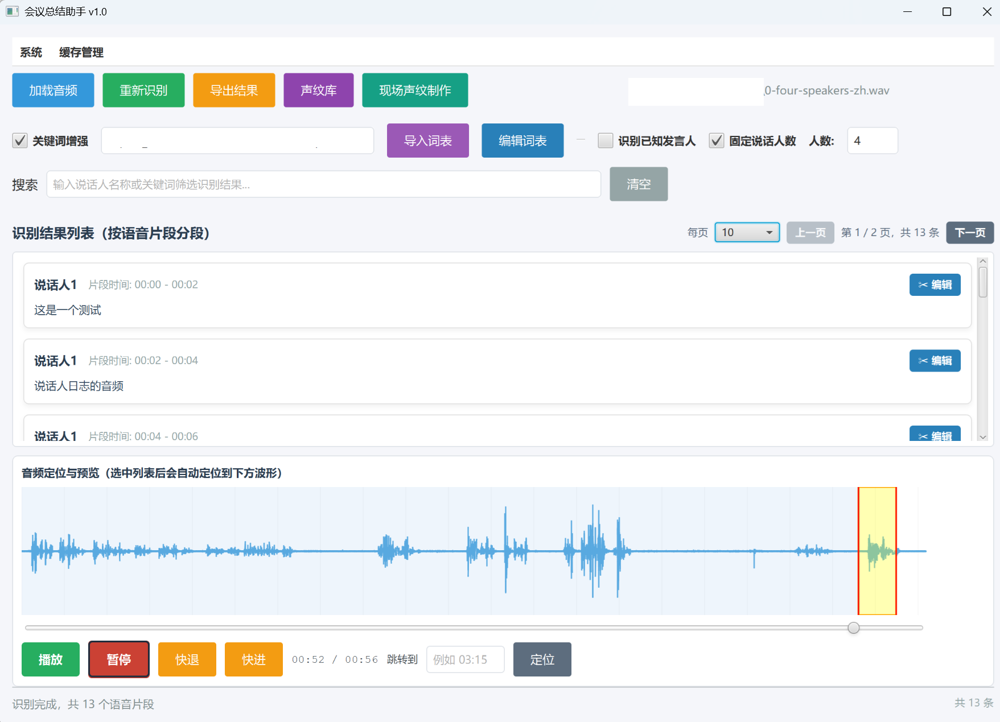
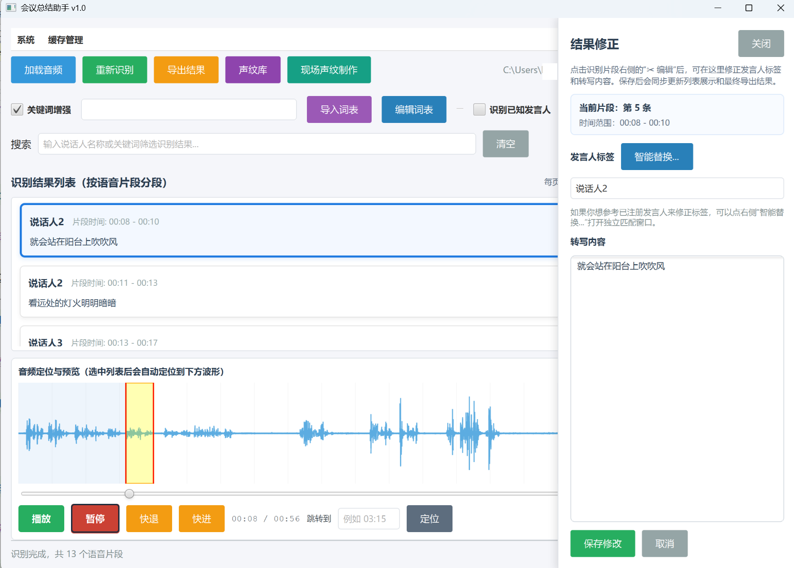
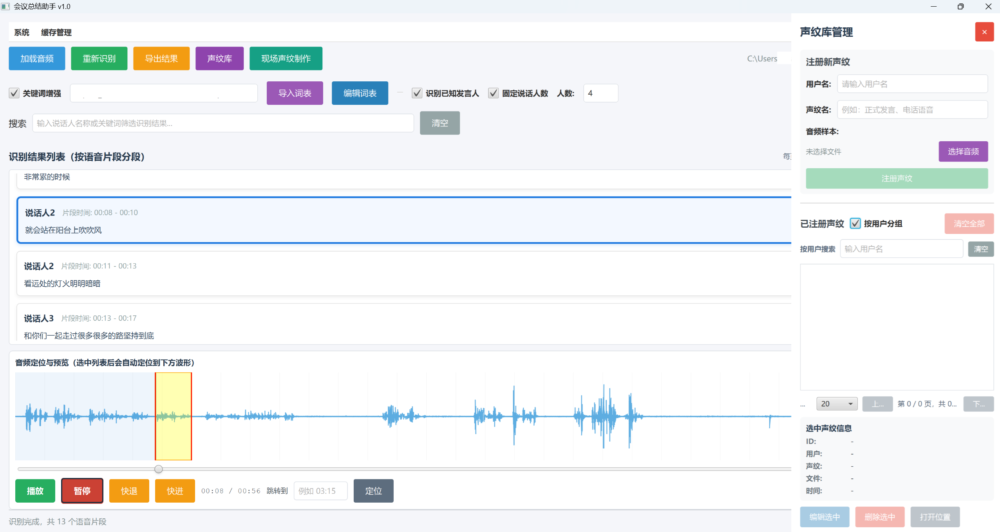
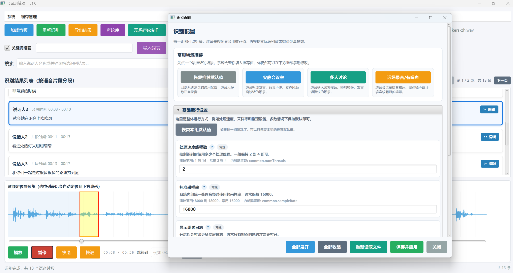
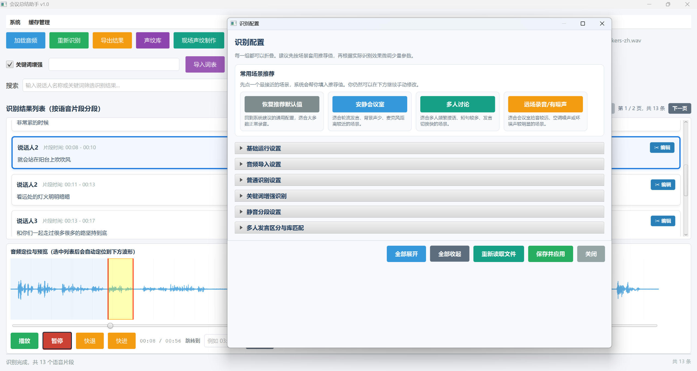
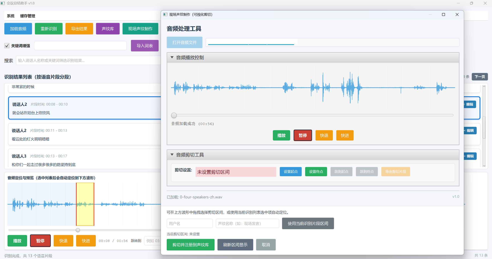

# AwesomeAudioAnalyzerForMetting

[](https://www.oracle.com/java/)
[](https://openjfx.io/)
[](https://github.com/k2-fsa/sherpa-onnx)

一个基于 JavaFX + sherpa-onnx 的会议音频识别、说话人区分与声纹库管理工具。

用于将会议录音文件转换为可编辑、可播放定位、可按说话人管理的结构化转写结果，并支持热词增强、声纹注册、智能发言人匹配、结果修正与导出 **（离线本地模式）**。

---

## ✨ 功能特性

- ✅ 支持会议音频导入与自动转码
- ✅ 支持 `wav`、`mp3`、`m4a`、`aac`、`flac`、`ogg`、`wma`、`amr` 等常见音频格式
- ✅ 支持基于 ffmpeg 的非 WAV 音频自动转换
- ✅ 支持 Paraformer 普通离线识别
- ✅ 支持 Conformer Transducer 热词增强识别
- ✅ 支持热词词表导入、编辑与默认样例重置
- ✅ 支持 VAD 语音分段
- ✅ 支持说话人区分：
    - 固定人数聚类
    - 动态人数聚类
- ✅ 支持声纹库管理：
    - 注册声纹
    - 用户分组
    - 按用户搜索
    - 编辑声纹信息
    - 删除声纹
    - 打开声纹音频所在位置
- ✅ 支持现场声纹制作：
    - 可视化波形剪切
    - 从当前音频片段直接注册声纹
- ✅ 支持识别结果分页展示
- ✅ 支持识别结果右侧固定编辑按钮
- ✅ 支持识别片段与底部波形联动定位
- ✅ 支持播放、暂停、快进、快退、手动时间跳转
- ✅ 支持智能替换发言人标签
- ✅ 支持 SQLite 临时检索索引
- ✅ 支持缓存管理：
    - 清空中转文件
    - 清空转译结果数据库
    - 清空声纹库文件
    - 重置热词词表

---

## 🖥️ 软件界面结构

### 主界面



### 识别结果编辑

| 样例1      | 样例2        | 样例3        |
| --------------- | --------------- |  --------------- |
|  |  | |

### 声纹库管理



### 配置面板

| 样例1      | 样例2        | 
| --------------- | --------------- | 
|  |  |

### 现场声纹制作



---

## 📂 项目结构

```
<root project>
│
├── lib                                      // Java 依赖库
│   ├── sherpa-onnx-v1.12.10.jar
│   ├── sherpa-onnx-native-lib-win-x64-v1.12.10.jar
│   ├── sqlite-jdbc-3.53.0.0.jar
│   └── sqlite-jdbc-3.53.0.0-natives-all.jar
│
├── models                                   // 模型资源目录，资源文件从 GitHub Releases 下载后解压到这里
│   └── README.md                           // 模型包下载与放置说明
│
├── src/com/controller                       // 控制层
│   ├── RecognitionBackendController.java
│   ├── AudioPlayerController.java
│   └── VoicePrintLibraryController.java
│
├── src/com/gui                              // JavaFX 自定义界面组件
│   ├── SherpaConfigDialog.java
│   ├── VoicePrintSidePanel.java
│   └── WaveformCanvas.java
│
├── src/com/main                             // 应用主入口
│   └── MeetingSummaryApp.java
│
├── src/com/model                            // 数据模型
│   ├── SpeechRecognitionUnit.java
│   └── VoicePrint.java
│
├── src/com/recognition                      // 识别、分段、声纹匹配逻辑
│   ├── SherpaOnnxJavaRecognizer.java
│   ├── SpeakerDiarizationService.java
│   ├── VoicePrintSmartMatchService.java
│   ├── AudioSourceResolver.java
│   └── CacheMaintenanceService.java
│
├── src/com/resource                         // 静态资源
│   ├── ffmpeg.exe
│   ├── FrontProfile.java
│   └── font/
│
├── src/com/search                           // SQLite 临时检索索引
│   └── RecognitionSearchStore.java
│
├── temp_audio_workspace                     // 默认临时工作目录
├── sherpa_onnx.properties                   // 当前运行配置
└── sherpa_onnx.properties.example           // 配置模板
```

---

## 运行环境要求

| 组件 | 版本 / 要求 | 说明 |
| --- | --- | --- |
| 操作系统 | Windows 64 位（其他系统请自行编译适配） | 当前内置 native jar 和 ffmpeg 面向 Windows |
| Java | JRE 8 / JDK 8 | 普通用户安装 JRE 8 即可运行，开发者可使用 JDK 8 |
| UI | JavaFX 8 | 随 JDK 8 一起使用 |
| ASR | sherpa-onnx v1.12.10 | 已内置 Java jar 与 Windows native jar |
| 数据库 | SQLite JDBC 3.53.0.0 | 用于临时检索索引与声纹库管理 |
| 音频转换 | ffmpeg | 已内置于 `src/com/resource/ffmpeg.exe` |

---

## 模型与资源说明

由于模型文件体积较大，`models` 目录下的模型资源不直接放入普通 GitHub 源码仓库。

当前仓库保留代码、配置、依赖和模型目录说明；完整模型文件请从  [GitHub Releases 页面](https://github.com/Brian417-cup/AwesomeAudioAnalyzerForMetting/releases/tag/v1.0.0)
下载模型资源包，并解压到项目根目录下的 `models` 文件夹中。

Release 附件命名为：

```text
AwesomeAudioAnalyzerForMetting-models.zip
```

该压缩包中应直接包含 `models` 文件夹，或者解压后能够在当前目录得到 `models` 文件夹。

| 用途 | 默认路径 | 说明 |
| --- | --- | --- |
| 普通识别 | `models/paraformer-zh/model.int8.onnx` | Paraformer 识别模型 |
| 普通识别词表 | `models/paraformer-zh/tokens.txt` | Paraformer tokens |
| 热词增强 Encoder | `models/conformer-zh-stateless2/encoder-epoch-99-avg-1.onnx` | 默认使用 float32 |
| 热词增强 Decoder | `models/conformer-zh-stateless2/decoder-epoch-99-avg-1.onnx` | 默认使用 float32 |
| 热词增强 Joiner | `models/conformer-zh-stateless2/joiner-epoch-99-avg-1.onnx` | 默认使用 float32 |
| 热词增强词表 | `models/conformer-zh-stateless2/tokens.txt` | Conformer tokens |
| VAD 分段 | `models/vad/silero_vad.onnx` | 静音检测与语音分段 |
| 说话人分割 | `models/speaker/pyannote-segmentation-3-0.onnx` | 多人发言区分 |
| 声纹特征提取 | `models/speaker/3dspeaker_speech_eres2net_base_sv_zh-cn_3dspeaker_16k.onnx` | 声纹匹配 |

> 说明：当前默认优先使用 Conformer float32 模型。Paraformer 参考资源中仅包含 `model.int8.onnx`，因此普通识别链路仍使用该文件。

模型资源包解压后的目录应保持为：

```text
models
├── paraformer-zh
├── conformer-zh-stateless2
├── vad
└── speaker
```

不要把模型文件解压成 `models/models/...` 这种双层目录，否则程序会找不到默认模型路径。

---

## 🚀 快速开始

推荐通过 `JRE 8` 环境运行程序。程序文件和源码保留在 GitHub 仓库中，体积较大的模型资源请从 GitHub Releases 页面单独下载。

### Windows 平台

1. 从[指定链接](https://github.com/Brian417-cup/AwesomeAudioAnalyzerForMetting/releases/tag/v1.0.0)
   下载 `AwesomeAudioAnalyzerForMetting.jar`
   和 `AwesomeAudioAnalyzerForMetting-models.zip`。

2.将模型资源包解压到程序同级目录下的 `models` 文件夹。

3. 确认电脑已安装 `JRE 8` 或 `JDK 8`。
4. 确认运行目录结构完整：

```text
AwesomeAudioAnalyzerForMetting
│
├── AwesomeAudioAnalyzerForMetting.jar
├── lib
├── models
├── src/com/resource/ffmpeg.exe
└──sherpa_onnx.properties
```

6. 在 Windows `cmd` 中进入软件目录：

```bat
cd /d <AwesomeAudioAnalyzerForMetting完整路径>
```

7. 终端执行：

```bat
chcp 65001
java -Dfile.encoding=UTF-8 -jar AwesomeAudioAnalyzerForMetting.jar
```

> 💡 当前打包方式已经将主要 Java 依赖合并进 `AwesomeAudioAnalyzerForMetting.jar`，因此普通用户优先使用 `java -jar` 启动。

### 其他平台

待补充

---

## 📖 使用流程

### 1️⃣ 加载音频

点击顶部 `加载音频`，选择会议录音文件。

如果文件不是 WAV 格式，系统会根据配置自动调用 ffmpeg 转为标准 WAV。

### 2️⃣ 设置识别选项

可按业务需要勾选：

- `关键词增强`：启用 Conformer 热词增强模型
- `识别已知发言人`：结合声纹库识别具体用户
- `固定说话人数`：指定会议中发言人数

如果不勾选固定人数，系统会使用动态聚类。

### 3️⃣ 配置热词

勾选 `关键词增强` 后，系统会自动创建默认热词词表。

可使用：

- `导入词表`：导入外部 txt 热词文件
- `编辑词表`：直接编辑当前热词内容

推荐格式：

```text
武汉大学
武大
小米科技园
国家会议中心
```

热词主要用于提升专有名词识别概率，不是强制替换规则。

### 4️⃣ 开始识别

点击 `开始识别`。

识别过程中会逐步展示分段结果，并自动定位当前正在转写的片段。

识别结果列表支持：

- 分页
- 当前页滚轮浏览
- 搜索
- 片段选中联动波形
- `✂ 编辑` 修正发言人和内容

### 5️⃣ 播放定位

底部波形区域支持：

- 播放
- 暂停
- 快退
- 快进
- 进度条拖动
- 手动输入时间跳转

选中识别片段后，波形会自动定位到对应语音区间。

### 6️⃣ 修正结果

点击识别片段右侧 `✂ 编辑`，右侧会打开结果修正面板。

可修改：

- 发言人标签
- 转写文本

保存后会同步更新列表展示和最终导出结果。

### 7️⃣ 导出结果

点击 `导出结果`，将当前识别与修正后的内容导出为文本文件。

---

## 🎤 声纹库管理

点击顶部 `声纹库` 打开右侧声纹库面板。

支持：

- 注册新声纹
- 按用户分组
- 用户组折叠 / 展开
- 按用户搜索
- 分页展示
- 编辑选中声纹
- 删除选中声纹
- 打开音频文件所在位置
- 清空声纹库

同一用户可以注册多条声纹样本。智能匹配时会按用户聚合多条声纹相似度。

---

## 🔊 现场声纹制作

加载音频后，点击 `现场声纹制作`。

该功能用于从当前音频中直接截取一段声音并注册为声纹。

流程：

1. 打开现场声纹制作窗口
2. 在波形中选择剪切区间
3. 输入用户名和声纹名称
4. 点击 `剪切并注册到声纹库`

---

## ⚙️ 配置与缓存

### 🔧 识别配置

菜单入口：

```text
系统 -> 识别配置
```

配置窗口支持折叠分组展示，常用配置包括：

- 音频导入设置
- 普通识别设置
- 关键词增强识别
- 静音分段设置
- 多人发言区分与库匹配

### 🗑️ 缓存管理

菜单入口：

```text
缓存管理
```

支持：

- 清空中转文件
- 清空转译结果数据库
- 清空声纹库文件
- 重置热词词表
- 清空全部缓存

默认临时目录：

```text
temp_audio_workspace
```

---

## 📦 发版检查

发版前建议确认：

- ✅ GitHub 仓库中不提交 `models` 下的大模型文件
- ✅ GitHub Releases 中已经上传完整模型资源包
- ✅ 模型资源包解压后能够得到完整 `models` 目录
- ✅ `lib` 目录完整，或主程序 JAR 已经合并必要依赖
- ✅ `src/com/resource/ffmpeg.exe` 存在
- ✅ `sherpa_onnx.properties` 使用项目相对路径
- ✅ Java 8 编译通过
- ✅ 普通识别可运行
- ✅ 热词增强识别可运行
- ✅ 声纹库可注册、搜索、编辑、删除
- ✅ 非 WAV 音频可自动转换
- ✅ 识别结果可导出

---

## ❓ 常见问题

### 🔍 找不到模型文件

检查是否已经从 GitHub Releases 下载模型资源包，并确认解压后的 `models` 目录与 `AwesomeAudioAnalyzerForMetting.jar` 位于同级目录。

同时确认 `sherpa_onnx.properties` 中的模型路径仍然是项目相对路径，例如：

```properties
paraformer.model=models/paraformer-zh/model.int8.onnx
vad.model=models/vad/silero_vad.onnx
```

### 🔍 非 WAV 音频导入失败

检查：

- `src/com/resource/ffmpeg.exe` 是否存在
- `audio.autoConvertWithFfmpeg=true`
- `audio.inputFormats` 是否包含当前文件后缀

### 🔍 热词没有明显效果

热词是识别偏置，不是强制替换。

建议：

- 每行一个完整词或短语
- 优先写完整专有名词，再补简称
- 当前默认 `conformer.hotwordsScore=30.0`，如果误识别变多可适当降低
- 当前默认 `conformer.maxActivePaths=20`，如果机器性能较弱可适当降低

### 🔍 声纹匹配不稳定

建议：

- 每个用户注册多条样本
- 使用清晰、噪声较少的音频
- 调整 `speaker.matchThreshold`

---

## 📝 说明

当前版本主要面向 Windows + Java 8 环境。为避免 GitHub 普通仓库文件大小限制，`models` 下的大模型资源通过 GitHub Releases 单独托管；源码仓库保留程序代码、配置模板、依赖文件和模型目录说明。

本项目受益于以下优秀的开源项目：

1. **[sherpa-onnx](https://github.com/k2-fsa/sherpa-onnx)** - 高性能离线语音识别框架，提供 Paraformer、Conformer 等多种模型的 Java 绑定
2. **[JavaFX](https://openjfx.io/)** - 现代化的 Java UI 框架，用于构建跨平台桌面应用界面
3. **[SQLite JDBC](https://github.com/xerial/sqlite-jdbc)** - SQLite 数据库的 Java 驱动，支持嵌入式数据存
